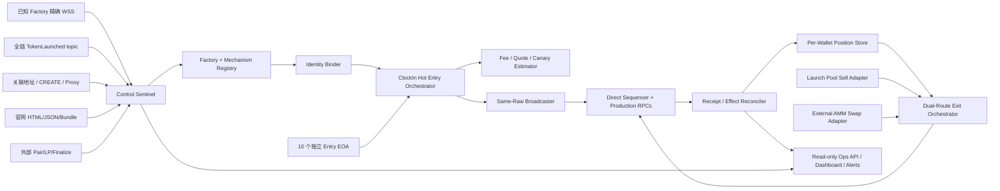
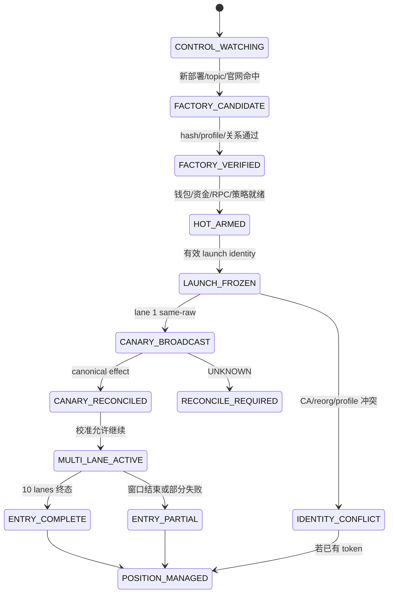

# ClockIn / Stonk Launcher 生产级狙击系统需求方案

> 文档状态：`SPEC_DRAFT_FOR_CONFIRMATION`
> 规格版本：`v1.0`
> 编制日期：`2026-08-16`
> 目标网络：Robinhood Chain Mainnet，`chainId = 4663`
> 目标代码库：`/Users/myandong/Projects/RH-pons-狙击/clockin-sniper`
> 本文性质：产品需求、协议需求、系统设计、实施拆分与验收标准；本阶段不实现代码、不创建新钱包、不签名、不广播交易。

---

## 1. 一句话结论

我们要建设的不是一个“看到 `CLOCKIN` 名字或 CA 就买”的脚本，而是一套长期在线的生产级狙击系统：

1. 在 ClockIn CA 尚未公开、Factory 可能更换、创建和开启可能原子发生的情况下，提前监控官方 Factory、关联地址集群、新合约、全链目标事件、官网字段和外部流动性事件；
2. 用 Factory 地址、runtime code hash、事件 ABI、creator、metadata、token/pool 代码和机制画像完成确定性身份绑定，名字只用于候选过滤；
3. 以 `10 个独立 EOA × 每个 EOA 一次、名义最多 5U` 的方式，在合约实际税率从初始值递减到实际 floor 的过程中分 10 档买入；ClockIn principal 固定上限 50U，principal 加预留 Gas 的 all-in 上限为 60U；
4. 第一笔 5U 同时承担“最早库存”和“有界实盘 canary”两种职能，通过真实 receipt、token 到账、精确状态 quote/fork 反推出实际总摩擦，校准后续九笔；
5. 买入后不能只留下残余仓位，必须同时支持发射池内盘卖出和 finalize/毕业后的外部 AMM 外盘卖出，按可执行净回款而非页面市值实施本金优先退出；
6. `CLOCKIN_STRATEGY` 和 `FIRST_OFFICIAL_LAUNCH_STRATEGY` 必须完全隔离。当前 50U 只属于 ClockIn；“首币策略”默认只监控，不得把 ClockIn 预算当作 fallback 使用。

这套机制的本质是：用多来源提前发现降低“发现延迟”，用确定性身份约束降低“买错标的概率”，用 10 个独立 EOA 消除单钱包 cooldown/nonce 串行瓶颈，用 10 档仓位将“抢得早但税高”和“等税低但价格被竞争者抬高”之间的时间风险离散化，最后用 receipt 与可执行退出报价闭合真实经济结果。

---

## 2. 需求理解与边界

### 2.1 已明确的业务目标

| 编号 | 需求 | 本方案理解 |
|---|---|---|
| BIZ-01 | 第一时间狙击 ClockIn | 主要触发器是已验证 Factory 的 launch/activation 事件，不等待公开 CA；已知 Factory 热路径与未知 Factory 预警并行运行。 |
| BIZ-02 | 40% 税率约 2 分钟递减 | 40%/2 分钟是当前 ClockIn 画像，不得当成全平台永久常量；执行时以最终合约读取结果和机制 profile 为准。 |
| BIZ-03 | 从初始税率到 0 分 10 批 | 业务意图是覆盖完整税率区间。实际最后一档取合约真实 floor；若真实 floor 为 0%，最后一档为 0%；若为 1%，不得伪造 0%。 |
| BIZ-04 | 每批 5U | 每笔投入的 quote principal 名义值为 5U，税从 5U 输入中扣除，Gas 不计入 5U；ClockIn 总名义本金上限 50U。 |
| BIZ-05 | 实盘生产，不要 Shadow/dry-run | 生产 executor 只有真实签名与真实广播路径；fork/replay 只作为离线验证工具，不是生产运行模式。 |
| BIZ-06 | 部署云服务器、CA 出来前持续准备 | Control Sentinel 和 Hot Executor 常驻，Factory/钱包/nonce/资金/RPC/策略均预热；CA 不是唯一启动信号。 |
| BIZ-07 | 防止换地址、换 Factory | 同时监控已知 Factory、关联地址集群、全链目标 topic、合约部署、官网字段和外部流动性事件，并维护版本化 Factory Registry。 |
| BIZ-08 | 参考 B20/MM 和 Pons 经验 | 复用 same-raw、UNKNOWN、nonce 隔离、receipt 核账、Validity Envelope、内外盘分离等通用能力，不盲目复用单钱包/固定目标假设。 |
| BIZ-09 | 私钥不能进入仓库 | 10 个执行私钥必须在仓库外或 Secret Manager/systemd credentials 中；日志、数据库、Git、npm 包不得出现私钥或完整带凭证 RPC。 |
| BIZ-10 | 买入后能退出 | 交付标准包含真实可调用的内盘 sell adapter、外盘 swap adapter、route migration、净回款计算和逐钱包退出状态机。 |

### 2.2 本方案不把以下内容当成已证实事实

- ClockIn 最终主网 CA；
- 最终 Launcher Factory 地址、runtime code hash、proxy implementation、creator；
- 最终事件 ABI、buy/sell ABI、quoteAsset 和 finalize/graduate 事件；
- 最终初始税率一定为 40%、窗口一定为 120 秒、floor 一定为 0%；
- 每个 EOA 一定可买 500 万枚或 5U 一定小于窗口 cap；
- anti-bot 一定只作用于合约中介，或 10 个 EOA 一定不会触发其他全局限制；
- 外盘一定是某一个指定 Router/“up”池；
- 50U 策略具备正期望或一定能抢到首块；
- 本地测试通过等于已经成交或已经能卖出。

这些字段在进入生产 `HOT_ARMED` 前必须由最终合约、官方页面或可验证链上状态补齐，并生成不可变的 `MechanismProfile` 与 `FactoryProfile`。

### 2.3 生产与验证的关系

- 生产 executor 不实现 Shadow 或 dry-run 分支，防止实盘时误启模拟模式。
- 单元测试、集成测试、历史 replay、mainnet fork 是上线前验证设施，不能被当作成交证据。
- `RPC accepted`、`already known`、交易哈希出现均不是成交；只有 canonical receipt、资产变化和可执行退出结果构成经济事实。
- 真实生产执行只使用当前已授权预算，不因测试环境存在而自动扩大资金范围。

---

## 3. 四项核心决策及最终推荐

### 3.1 决策一：狙击对象与预算如何组织

| 方案 | 描述 | 优点 | 缺点 | 结论 |
|---|---|---|---|---|
| A | 只做 ClockIn | 最简单、不会分散预算 | Factory 换版或首币热度机会无法形成独立能力 | 不选 |
| B | 不管 ClockIn，见首币就买 | 触发最早 | 极易买到非目标、偷跑币或低质量首发 | 不选 |
| C | ClockIn 与首个官方 launch 双策略隔离 | 同时覆盖目标币和范式机会；预算、身份、退出互不污染 | 模块更多 | **推荐并作为默认方案** |
| D | ClockIn 没命中就把 50U 自动切给首币 | 资金利用率高 | 把“目标未出现”错误转换为“可买其他币”，风险不可控 | 明确禁止 |

默认策略：

- `CLOCKIN_STRATEGY`：真实资金，名义本金 50U，10 批 × 5U。
- `FIRST_OFFICIAL_LAUNCH_STRATEGY`：默认 `MONITOR_ONLY`、预算 0U，只记录第一个“通过官方身份规则的有效 launch”。
- 若用户以后单独增加 5U，则首币策略只允许独立 1 笔 canary，使用独立钱包、独立预算、独立退出状态机。
- 两个策略命中同一个 ClockIn CA 时必须 dedupe，以 ClockIn 策略为唯一资金 owner，严禁双重购买。

### 3.2 决策二：钱包模型

| 方案 | 描述 | 对 2 分钟窗口的影响 | 风险 | 结论 |
|---|---|---|---|---|
| A | 1 个 EOA 连续买 10 次 | 受 per-wallet cooldown、receipt、连续 nonce 阻塞 | 一笔 UNKNOWN 可卡住后九笔 | 当前实现，目标版本不采用 |
| B | 10 个 EOA，每个只负责 1 档 5U | 每个钱包 nonce/cooldown 独立，可按税率并行准备 | 需要多钱包资金与密钥管理 | **推荐并作为默认方案** |
| C | 155 个 EOA 蚂蚁搬家 | 容量极大 | 资金碎片、密钥、Gas、回收和退出复杂度远超 50U 需要 | 不选 |
| D | 中介合约批量买 | 调度方便 | 可能触发 EOA-only/anti-contract 限制 | 不选，除非最终合约证明允许 |

默认钱包拓扑：

- `clockin-entry-01` 至 `clockin-entry-10`，每个 EOA 只发一笔 5U entry；
- 每个钱包独立 nonce lease、资金 reservation、广播状态、receipt 和 position lot；
- 某一 lane 出现 UNKNOWN 只冻结该 lane，不阻塞其他钱包；
- 买入后先按原钱包卖出，不提前归集 token，直到 transfer tax、anti-bot、maxWallet 和外盘路由经过真实机制验证；
- 10 个 EOA 不是为了绕过全局 cap，而是消除 per-EOA cooldown、nonce 串行和单点故障；全局 cap 仍必须遵守。

### 3.3 决策三：税率估计与买入时机

| 方案 | 描述 | 问题 | 结论 |
|---|---|---|---|
| A | 本地按 120 秒线性计时 | block timestamp、启动点、floor 或公式可能不同 | 不选 |
| B | 小钱包不断微量买入测税 | 每次 probe 都消耗 Gas/税、改变池状态、可能触发 cooldown | 仅作为 ABI 不可读时的独立后备，不默认启用 |
| C | 读合约 declared fee，第一笔 5U 同时做 canary，receipt 持续校准 | 速度、信息和资金成本平衡最好 | **推荐并作为默认方案** |
| D | 10 笔全部完成后再核算 | 发现机制错误时已无法停止未发 tranche | 不选 |

默认规则：

- `currentFeeBps()` 或该机制 profile 的官方 fee getter 是 declared fee 真值；
- 第一笔 5U 是本来就要买的第 1 档，不额外增加 probe 资金；
- receipt 后用真实 token delta、精确状态 quote、无税曲线估计、Gas 和 price impact 分解实际摩擦；
- 后续每笔继续更新估计，发生明显漂移时仅停止尚未发送的 entry lane，已经形成的 position 继续由 exit 模块管理；
- 如果 getter/ABI 完全不可读，才允许启用单独授权的 `MICRO_PROBE_ADAPTER`，推荐最大 0.25U、最多一次，不得“无限买入探测”。

### 3.4 决策四：退出模式

| 方案 | 描述 | 问题 | 结论 |
|---|---|---|---|
| A | 不自动卖，只记录余额 | 无法形成经济闭环 | 当前实现，目标版本必须替换 |
| B | 固定倍数、只走一个 Router | launch pool 到外盘的生命周期变化会使 route 失效 | 不选 |
| C | 先把 10 个钱包 token 归集再卖 | 可能产生 transfer tax、黑名单、maxWallet 或额外延迟 | 首版不选 |
| D | 内盘/外盘双 route，按钱包卖出，本金优先 | 能适应 finalize 前后，并避免早期归集风险 | **推荐并作为默认方案** |

初始参数建议（均可配置，尚需用户最终确认）：

- 当全仓可执行净清算价值约达到总实际成本的 `2.0×` 时，卖出“刚好足以覆盖全部本金 + 已付 Gas + 已付买税 + 预计卖税/卖出 Gas”的最小 token 数量；
- 当剩余仓位可执行净价值约达到对应剩余成本的 `3.0×` 时，再卖出一个原始 tranche 等价值仓位，默认约为初始 token 总量的 10%；
- 剩余 runner 使用可执行净价值峰值回撤约 `25%`、动量失效或最长持仓时间三者中最先触发者退出；
- 所有倍数都基于当前可执行 sell quote，不使用网页市值、最后成交价或无流动性的标记价格。

### 3.5 推荐组合

本文按 `C-B-C-D` 组合设计：

- 双策略隔离；
- 10 个一次性 entry EOA；
- fee getter + 第一笔 5U canary；
- 双 route、本金优先、逐钱包退出。

---

## 4. 第一性原理与 Race Thesis

### 4.1 真正争夺的资源

本项目争夺的不是“最早拿到 CA”本身，而是以下资源的组合：

1. 目标 launch 早期、尚未被竞争者显著推高的可买配额或曲线库存；
2. 在税率递减过程中，税率下降与价格上涨之间的最优交换；
3. 在 per-EOA cooldown、cap、EOA-only 和 FCFS 排序下，尽可能早的合法 inclusion；
4. 在 launch pool 和外部 AMM 两阶段都能兑现的真实流动性。

### 4.2 收益来源

一笔 tranche 的预期净边际不是“涨幅”，而是：

```text
ExpectedNetEdge(t)
  = ExpectedExecutableSellValue(t_exit)
  - QuotePrincipalIn
  - BuyDynamicFee
  - TokenTransferTax
  - CurvePriceImpact
  - EntryGas
  - ExitTaxAndPriceImpact
  - ExitGas
  - FailureAndUnknownCost
```

因此：

- 最早买入：价格可能最低，但税率最高；
- 最晚买入：税率最低，但竞争者可能已把曲线价格抬高、cap 可能耗尽；
- 10 档买入是在未知竞争强度下对时间/税率曲线做离散积分，而不是认为 10 个时点都必然盈利；
- 第一笔高税 5U 的信息价值来自“最早库存 + 真实机制反馈”，它的损失上界由 5U principal 限定；
- 多钱包提高的是合法并行度和故障隔离，不会凭空创造流动性或正期望。

### 4.3 排序机制

- Robinhood Chain 目标环境按 Sequencer 到达顺序竞争，系统必须把“事件到达本机 → 本地决策 → 第一条 sendRawTransaction 调用”的延迟作为核心指标。
- 提高 Gas 只保证交易具有足够 inclusion 条件，不应被当成可以购买排序优先权的唯一手段。
- 同一个 lane 只能生成一个 canonical signed payload；对多个 RPC 和 direct Sequencer 广播的必须是完全相同的 raw bytes。
- `unknown` 时只能重发相同 raw bytes，不能生成新 nonce 或同 nonce 不同 payload。

### 4.4 最早可推断、最早可授权与最终结果信号

| 级别 | 示例 | 用途 | 是否可直接授权花钱 |
|---|---|---|---|
| S2 预警信号 | 关联地址部署合约、资金/owner/implementation 关系、官网 bundle 变化、外部 Pair/LP 事件 | 提前编译候选 Factory/Profile，预热执行器 | 否 |
| S1 可执行信号 | 已验证 Factory 发出可解码 launch/activation 事件，token/pool 代码和机制 profile 在同一 canonical block 可读 | 冻结目标并形成 entry intent | 依身份等级决定 |
| S0 结果信号 | 官方 CA、canonical receipt、token delta、finalize、外部流动性与真实 sell quote | 确认/纠错、核账与退出 | CA 只做确认；receipt 才是经济结果 |

CA 通常是 S0/S1.5 确认信号，可能晚于最有价值的 entry 时点；名字是弱候选字段；Factory event 才是主触发器。

### 4.5 竞争者

- 已知 Factory 事件监听器；
- 全链 topic 监听器；
- 关联地址/部署图谱监听器；
- Sequencer feed 或专用节点用户；
- 多 EOA 蚂蚁搬家脚本；
- 项目方/白名单/内部地址；
- 官网 CA 抓取脚本；
- 直接轮询 pool fee/cap 的买入机器人。

我们的可控优势不是“比所有人都多钱包”，而是：

- 在 launch 前把 Factory/Profile/钱包/资金/nonce/广播端预热完成；
- 已知 Factory exact subscription 与未知 Factory topic-wide sentinel 并行；
- 热路径不依赖 AI、网页加载、人工确认或外部价格 API；
- 10 个 EOA 分离 per-wallet 限制；
- receipt 反馈及时影响未发 lane；
- entry 与 exit 从一开始就是同一经济闭环。

---

## 5. 目标系统总体架构

### 5.1 权限平面

系统拆成两个安全域：

1. **Control Plane（无私钥）**：负责多源监控、地址图谱、Factory/Profile 注册、网站 fallback、证据归档、告警和 readiness；
2. **Execution Plane（有私钥）**：负责独立链上复核、资金 reservation、10 个 EOA 签名/广播、receipt、position 和 exit。

Control Plane 的判断不能单独强迫 Execution Plane 花钱。Execution Plane 必须根据本地已批准策略和链上同块证据再次验证 chain ID、Factory code hash、事件、token/pool 代码和 mechanism profile。



### 5.2 建议进程

| 进程 | 是否持有私钥 | 职责 | 故障影响 |
|---|---:|---|---|
| `clockin-control-sentinel` | 否 | 24×7 监控所有信号、Factory 候选与官网 CA | 失去未知 Factory/官网 fallback；已知 Factory热路径仍可运行 |
| `clockin-executor` | 是 | ClockIn/首币策略路由、10 lane entry、same-raw 广播 | 新 entry 暂停；已签 UNKNOWN 由 reconciler 接管 |
| `clockin-reconciler` | 否或仅可访问 signed-tx vault | receipt、token delta、Gas、UNKNOWN 恢复 | 不得产生新 intent；恢复后补齐经济事实 |
| `clockin-exit` | 是 | 内盘/外盘 quote、授权、sell/swap、回款核账 | position 保留并告警；不能因 entry 停止而自动停止 |
| `clockin-ops` | 否 | localhost health/readiness/API/只读 dashboard | 不影响链上执行 |

首个可交付版本可在一个 Node.js service 中运行这些模块，但边界、数据库 lease 和权限必须按上述进程模型设计，以便后续拆分而不改变业务语义。

### 5.3 热路径与暖路径

**热路径必须只包含：**

```text
verified WSS log
→ deterministic decode
→ registry/hash lookup
→ exact-block pool reads
→ strategy authorization
→ lane reservation
→ calldata/sign
→ same-raw fanout
```

**不得位于热路径：**

- AI 分析；
- 打开网页或浏览器渲染；
- X API；
- ETH/USD 实时请求；
- 大范围链上回溯；
- Fork；
- 人工二次点击；
- 生成/分发钱包；
- 数据库迁移或日志压缩。

这些工作必须在 launch 前由暖路径预先完成，或在首笔广播后异步运行。

---

## 6. 双策略需求

### 6.1 `CLOCKIN_STRATEGY`

目标：只买满足 ClockIn 确定性身份策略的 token。

必须满足：

- `strategyId = clockin-mainnet-v1`；
- 预算 owner 为 ClockIn，principal cap = 50U，all-in risk cap = 60U，禁止自动补款；
- 10 个 lane，每个 principal cap = 5U；
- name/symbol 可配置，但从不单独授权；
- 预期 creator、metadata、token suffix、Factory/Profile 证据按最终公开信息填充；
- 第一条满足完整冻结规则的 launch 成为唯一 target；后续同名事件不得覆盖；
- official CA 与冻结 CA 冲突时，未发 entry 停止，已持仓进入 exit/人工处置，不得销毁账本；
- 同一 launchId 只能执行一次，重启不能重复创建预算。

### 6.2 `FIRST_OFFICIAL_LAUNCH_STRATEGY`

目标：捕捉“官方 Factory 的第一个有效 launch”作为独立研究/可选 canary，不等同于 ClockIn。

“第一个”的定义：

1. emitter 必须属于 `VERIFIED` FactoryProfile；
2. launch 必须满足该 Factory 的 creator/authorization 语义，不能把 permissionless 偷跑或测试 launch 当作官方首币；
3. 按 canonical `(blockNumber, transactionIndex, logIndex)` 排序；
4. removed/reorg 日志不计入；
5. 如果第一个有效 launch 就是 ClockIn，自动合并到 ClockIn strategy，不重复占用预算。

默认只记录：candidate、profile、pool、初始 fee/cap、后续价格、可买/可卖结果和最终 PnL replay，不签名、不广播。

### 6.3 策略隔离不可变条件

- 不共享 principal reservation；
- 不共享钱包；
- 不共享 nonce lease；
- 不共享 position/exit plan；
- 不因一个策略失败而自动激活另一个策略；
- 可共享只读 Factory Registry、RPC transport、代码和观测数据；
- 所有 EffectRecord 必须有唯一 `strategyId` 和 `budgetId`。

---

## 7. Control Sentinel：未知 Factory 与多源监控

### 7.1 监控通道

#### CH-A：已知 Factory 精确监听

- 对所有 `VERIFIED` Factory 地址订阅 exact address + exact event topic；
- 采用 subscribe-before-backfill，覆盖启动和重连缝隙；
- 这是最低延迟、最高确定性的主通道；
- 每个 Factory 绑定 runtime code hash、proxy implementation hash、event ABI hash 和 ProtocolAdapter 版本。

#### CH-B：全链事件 topic 监听

- 订阅 `TokenLaunched` 及已登记版本的所有等价 launch event topic，不限定 address；
- 新 emitter 只能生成 `FACTORY_CANDIDATE`，不能因名字相同直接花钱；
- 在同一 blockTag 读取 emitter runtime、proxy slots、token/pool code、getter 行为和 deployer 关系；
- 若 code hash 已在允许的 Factory family 中，可快速升级；未知 hash 必须进入独立 profile 分析。

#### CH-C：关联地址集群

监控对象包括：

- 官方 deployer EOA；
- 官方 multisig/owner/admin；
- 已知 Factory 的 deployer、proxy admin、implementation deployer；
- 官网公开运营钱包或 launch operator；
- 经可验证链上关系确认的一跳 funder/creator；
- 已知外部流动性添加地址。

监控行为包括：

- EOA 创建合约；
- Factory/proxy/implementation 部署；
- owner/admin/implementation 变更；
- 已知地址首次调用新合约；
- CREATE2 salt/deployer 关系；
- 交易 receipt 中的新 contractAddress；
- 与已知 Factory 相同/近似的 runtime/selector/event fingerprint。

地址图谱不能无限自动扩张。每条边必须记录 `sourceTxHash`、`relationshipType`、`observedBlock` 和审核状态，防止任意转账污染“关联地址”。

#### CH-D：官网与前端 bundle fallback

- 监控官网 HTML、公开 JSON、JS bundle、runtime config、API 响应中的明确字段；
- 优先读取结构化 `contractAddress`/Factory/chainId 字段，禁止从页面任意 0x 文本中取第一个地址；
- 每次变化保存 source URL、ETag/Last-Modified、content hash、抓取时间和解析路径；
- 官网信号可确认 CA、Factory、metadata 或 launch 时间，但不能绕过链上代码复核；
- 网站不可用不得阻塞已验证 Factory 的热路径。

#### CH-E：外部 Pool / Finalize 交叉验证

- 监控已验证外部 Factory/Router 的 PairCreated、PoolCreated、Mint/Sync、AddLiquidity 或项目自定义 finalize 事件；
- 以 token、quoteAsset、creator、launchId 和 finalize receipt 做关联；
- 新 pool 只有在 runtime/Factory/quote/liquidity 可验证后才能成为 exit route；
- 仅看到“添加流动性”文本或同名 Pair 不足以认定可卖。

### 7.2 Factory Registry 状态

```text
OBSERVED
→ FINGERPRINTED
→ PROFILE_MATCHED
→ VERIFIED
→ HOT_ARMED

任一步冲突：QUARANTINED
代码/实现发生变化：STALE_REVERIFY_REQUIRED
```

每个 FactoryProfile 至少包含：

- chainId；
- Factory address；
- deployed block/tx/deployer；
- direct runtime code hash；
- proxy type、implementation address/hash、admin slot（如适用）；
- launch event topic、完整 ABI hash、decoder version；
- pool/token creation semantics；
- buy/sell/finalize adapter ID；
- 已验证 creator/owner；
- 支持的 quoteAsset；
- 证据来源和最后复核 block；
- 状态及状态变更原因。

### 7.3 AI 的边界

- AI 可在暖路径对未知 bytecode、selector、事件、地址关系做排序和生成分析报告；
- AI 输出只能是候选证据，不能直接把 Factory 状态改成可花钱的 `VERIFIED`；
- 热路径不调用 LLM；
- 自我修复只能重启监听、切换 RPC、回补 block 或重新解析，不能自行改变预算、身份策略、ABI 或 exit 阈值。

---

## 8. 身份绑定与授权模型

### 8.1 名字、Factory 和 CA 的角色

- 名字/symbol：候选过滤；可伪造，不能授权。
- Factory + code hash + ABI + creator/metadata：主要 launch 身份与最早链上授权依据。
- CA：Factory event 的结果地址；官网 CA 是独立确认/冲突信号，不应成为唯一发现入口。
- token/pool runtime：验证实际执行目标与预期 profile 一致。

### 8.2 LaunchIdentity 冻结字段

首个满足策略的事件必须原子冻结：

- `chainId`；
- `strategyId` / `launchId`；
- Factory address/profile revision；
- launch transaction hash；
- block hash、block number、transaction index、log index；
- creator；
- token CA；
- pool CA；
- name/symbol；
- metadata URI/hash/image hash；
- token/pool runtime code hash；
- mechanism profile revision；
- 事件来源（exact WSS/topic-wide/backfill）；
- 冻结时间和配置 hash。

一旦冻结：

- 后续同名事件不能覆盖；
- 官网出现不同 CA 进入 `IDENTITY_CONFLICT`；
- reorg/removed log 进入 `REORG_RECONCILE`；
- 所有已签/已发交易继续按 txHash 核账，不允许抹去历史；
- 未发 lane 按授权策略停止或等待。

### 8.3 推荐的分级授权

| 等级 | 条件 | 可做动作 |
|---|---|---|
| L0 Candidate | name/topic/官网/关联地址任一命中 | 记录、预取代码、不得签名 |
| L1 Factory Verified | chainId、Factory runtime/implementation hash、event ABI 与 Registry 完全匹配 | 解码和冻结 launch |
| L2 ClockIn Bound | L1 + creator/metadata/suffix/token/pool profile 满足 ClockIn policy | 允许第 1 个 5U lane |
| L3 Independent Confirmed | L2 + 官方 CA 匹配，或预先批准的高强度链上绑定组合 | 允许后续九个 lane |
| L4 Effect Confirmed | canonical receipt + token delta | 形成真实 position/effect |

为兼顾速度与误买风险，推荐 `HYBRID_CA_GATE`：

- L2 到达后立即发送 lane 1；
- lanes 2–10 在官方 CA 匹配后解锁；
- 如果最终 creator、metadata hash 和 Factory profile 已被官方在 launch 前完整发布，可将该组合预先批准为 L3，不强制等待网页 CA；
- 官网 CA 任何冲突都会停止未发 lanes；
- 禁止运行时由 AI 自动把弱信号提升为 L3。

该策略比当前“一律第 2–10 笔等 CA”更有机会覆盖 2 分钟窗口，同时不退化为名字狙击。

### 8.4 机制版本检测

系统不得把一个 ABI 当成所有 Stonk launch 的通用事实。至少区分：

- `CLOCKIN_40PCT_2MIN_V1`：当前讨论画像；
- `SAFE_LAUNCH_99PCT_99MIN`：公开预览中的另一机制；
- `FIXED_PRICE_SALE`；
- `BONDING_CURVE_SALE`；
- `CUSTOM_OR_UNKNOWN`。

Profile 检测输入包括：

- Factory/Pool code hash；
- getter selector 与返回值；
- fee 起点、floor、decay 公式和时间源；
- inSniperWindow/activation 语义；
- per-wallet/global cap；
- cooldown scope；
- EOA-only 时长；
- quote asset；
- buy/sell/finalize ABI；
- token transfer tax/hook；
- launch pool 到外盘的迁移规则。

如果实际为 99%/99 分钟或未知 profile，ClockIn 40%/2 分钟策略不得把其硬套成十档执行。该 candidate 保留监控与证据，但进入 `PROFILE_UNSUPPORTED_FOR_STRATEGY`。

---

## 9. 钱包、资金与 5U 定义

### 9.1 钱包角色

| 钱包 | Entry 职责 | Entry 上限 | 后续职责 |
|---|---|---:|---|
| `entry-01` | 初始费率档 + live canary | 5U | 持有 lot-01，按原钱包退出 |
| `entry-02` | 第 2 税率档 | 5U | 持有 lot-02，按原钱包退出 |
| `entry-03`…`entry-09` | 中间税率档 | 各 5U | 各自持仓和退出 |
| `entry-10` | 实际 floor 档 | 5U | 持有 lot-10，按原钱包退出 |
| `first-launch-canary` | 可选首币策略 | 默认 0U，显式授权后 5U | 与 ClockIn 完全隔离 |

### 9.2 5U 的精确定义

- `U` 是名义美元计价单位，不直接等于链上 wei；
- 对 native ETH quote pool，launch 前由独立 Price Snapshot 把 5U 转成固定 `batchValueWei`；
- 对 stablecoin quote pool，按 token decimals 把 5U 转成 raw amount；
- 每个 tranche 的链上 principal 不超过冻结的 5U 等价值；
- dynamic buy fee 从 principal 中扣除，不额外把该笔增大到 5U + fee；
- Gas、approve Gas 和退出 Gas 单独预算；
- 报表同时记录 nominal U、实际 quote raw、冻结汇率、实际成交时汇率和偏差。

Price Snapshot 必须在 launch 前周期性更新，热路径只读取本地冻结值。建议默认：

- 使用一个主来源 + 一个交叉验证来源；
- 记录 source、timestamp、price 和偏差；
- 最大允许价格陈旧时间与容差为可配置项；
- 若用户选择手工固定 wei，也必须记录计算时间和隐含 ETH/USD，不得只记录“5U”。

### 9.3 资金准备

每个 ClockIn entry EOA 的最低余额：

```text
5U 对应 quote principal
+ 单笔 entry 最大 Gas reservation
+ 至少一笔 approve（若退出需要）Gas reservation
+ 至少一笔 sell/swap 最大 Gas reservation
+ 小额安全余量
```

系统总 readiness 必须分别显示：

- `principalReadyWallets = 10/10`；
- `entryGasReadyWallets = 10/10`；
- `exitGasReadyWallets = 10/10`；
- 总 principal reservation；
- 总 Gas reservation；
- 各钱包 latest/pending nonce；
- 是否存在未知 pending transaction。

### 9.4 资金不可变条件

- 每个 entry EOA 同一 launch 最多一个 entry intent；
- 单 lane principal 不得超过 5U 等值；
- ClockIn aggregate principal 不得超过 50U；
- Gas 不得通过提高 `value` 的方式混入 principal；
- 任何重启、WSS 重连、重复 log、官网重复 CA 都不能重新分配已消费预算；
- 首币策略永远不能借用 ClockIn 的 reservation；
- 一笔 UNKNOWN 仍占用该 lane 全额 reservation，直到 receipt/nonce/balance 被确定。

### 9.5 密钥管理

- 生成 10 个专用 EOA 时，只在终端/清单显示地址，不显示私钥；
- 私钥一钱包一文件，位于仓库外 mode `0600` 目录或 Secret Manager；目录 mode `0700`；
- 非秘密 wallet manifest 只保存 `walletId/address/role/expectedChain`；
- 部署服务器优先使用 systemd `LoadCredential` 或等价 secret mount；
- `.gitignore` 只是第二道防线；`secrets:check` 和 package 文件清单审计是发布门；
- 不在日志、SQLite、NDJSON、崩溃 dump、告警、截图中记录私钥、助记词、完整 authenticated RPC URL 或完整 signed raw transaction。

---

## 10. 十档买入策略

### 10.1 税率档位生成

对实际初始费率 `S`、实际 floor `F`、批次数 `N=10`：

```text
targetFee[i] = S - round((S - F) × i / (N - 1)), i = 0...9
```

示例一，若最终合约确认 `40% → 0%`：

| Tranche | 目标 fee bps | 目标费率 |
|---:|---:|---:|
| 1 | 4000 | 40.00% |
| 2 | 3556 | 35.56% |
| 3 | 3111 | 31.11% |
| 4 | 2667 | 26.67% |
| 5 | 2222 | 22.22% |
| 6 | 1778 | 17.78% |
| 7 | 1333 | 13.33% |
| 8 | 889 | 8.89% |
| 9 | 444 | 4.44% |
| 10 | 0 | 0.00% |

示例二，若最终合约 floor 实际为 `1%`：

| Tranche | 目标 fee bps | 目标费率 |
|---:|---:|---:|
| 1 | 4000 | 40.00% |
| 2 | 3567 | 35.67% |
| 3 | 3133 | 31.33% |
| 4 | 2700 | 27.00% |
| 5 | 2267 | 22.67% |
| 6 | 1833 | 18.33% |
| 7 | 1400 | 14.00% |
| 8 | 967 | 9.67% |
| 9 | 533 | 5.33% |
| 10 | 100 | 1.00% |

档位以 bps 整数持久化，禁止用浮点数参与签名决策。

### 10.2 触发依据

- 每个新 canonical head 在同一个 blockTag 读取 fee、window、cap、quote 和必要曲线状态；
- 当 `declaredFeeBps <= lane.targetFeeBps` 时，lane 进入 `FEE_ELIGIBLE`；
- 本地 wall-clock 的“第几秒”只用于观测，不用于替代链上 fee；
- 交易有效期绑定 chain timestamp/block/window，而不是进程启动时间；
- 第 10 lane 只有在实际 fee 到达真实 floor 或窗口明确结束条件满足时才触发。

### 10.3 第一笔 5U

lane 1 的目标：

1. 在 L2 ClockIn identity 达到后尽快广播；
2. 获取最早合法库存；
3. 验证实际 buy 方法、EOA 限制、cap、token delivery 和 fee 组合；
4. 为 lanes 2–10 提供 canary calibration。

若 launch event 已在 block N mined，且 pool 明确禁止同块外部买入：

- 本机收到 N 的 log 后立刻签名/发送；
- 最早期望 inclusion 为 N+1；
- 账本必须区分 `broadcastAtHead` 与 `includedBlock`；
- 不能把“prepositioned”表述为“保证 N+1”。

### 10.4 lanes 2–10

- 10 个钱包 nonce 独立，不需要等待前一钱包 cooldown；
- 默认仍等待 lane 1 canonical receipt 完成初次 calibration，再释放后续 lanes；
- 后续 lanes 不彼此串行等待 receipt，除非机制 profile 证明存在全局限制或资本状态依赖；
- 每个 lane 只发送一次新的 signed intent；UNKNOWN 只重发相同 raw；
- 每个 receipt 到达后继续校准剩余未发 lane；
- 某 lane 失败不自动把它的 5U 追加到下一 lane。

### 10.5 跨过多个 fee band 时的处理

WSS 中断、区块间隔或 fee 离散跳变可能使一个 head 同时跨过多个未发 band。需要策略字段 `catchUpPolicy`：

- `ONE_PER_BLOCK`：最保守，保持时间分散，但可能错失低税窗口；
- `ALL_ELIGIBLE`：立即发送所有已跨过 band，税更低但可能在同一曲线价格集中买入；
- `QUOTE_RANKED_BOUNDED`：按当前可执行 tokenOut/5U 排序，在单块释放有限数量。

推荐默认 `QUOTE_RANKED_BOUNDED`，`maxConcurrentCatchUpLanes = 2`。若无法得到可信 quote，则回退 `ONE_PER_BLOCK`。该参数需要通过历史 fork/replay 校准，不写死为平台常量。

### 10.6 cap、cooldown 和 EOA-only

- `windowMaxBuyBps`、`currentWindowCap`、`buyCooldownSecs`、`eoaOnlySecs` 必须进入实际授权与 sizing，不能只记录日志；
- profile 必须标注 cap 是 per-wallet、per-tx 还是 global；
- 若 5U 超过单笔合法 cap，默认该 lane `INCOMPATIBLE_5U_CAP`，不得悄悄拆成多笔或放大钱包数；
- 若 cap 可换算且用户批准“最多 5U”，可执行小于 5U；本方案默认业务语义仍是每次 5U，是否允许缩量属于用户决策；
- 10 EOA 只能消除 per-wallet cooldown，不得绕过全局 cooldown；
- EOA-only 期间必须由 EOA 直接调用 pool，不能经过自建批量合约。

### 10.7 价格保护

当前 `minTokensOut = 1 raw unit` 只适合极端速度优先，不是完整价格保护。目标方案提供：

- lane 1：推荐 `SPEED_CANARY`，使用机制可接受的最小非零 minOut，同时以 5U principal 限制最坏损失；
- lanes 2–10：推荐 `QUOTE_BOUNDED`，基于同块 preview/curve quote 设置 minOut，并附有效 block/time envelope；
- 如果 profile 没有可验证 quote，明确记录 `QUOTE_UNAVAILABLE`，不得把 minOut=1 描述为已控制滑点；
- minOut 策略、quote block、容差和实际 tokenOut 必须写入 EffectRecord。

---

## 11. 税率、到账和实际摩擦校准

### 11.1 必须分开的四类数值

1. `declaredPoolFeeBps`：pool getter 声明的动态 fee；
2. `tokenTransferTaxBps`：token transfer/mint/burn/hook 带来的额外摩擦；
3. `curvePriceImpactBps`：5U 在当前曲线/储备造成的价格影响；
4. `executionDriftBps`：从 quote block 到 inclusion state 的竞争、排序和状态漂移。

不能把这四项都叫“税率”。

### 11.2 canary 观测

lane 1 广播前保存：

- parent block/hash；
- pool reserves/curve state；
- declared fee；
- no-fee theoretical output（若 adapter 可计算）；
- protocol preview output（若存在）；
- minTokensOut；
- quote principal raw；
- cap/window 状态。

receipt 后保存：

- receipt status/block/index；
- token Transfer logs；
- beneficiary balance before/after/delta；
- actual quote spent/refund；
- gasUsed/effectiveGasPrice；
- actual tokenOut；
- 当前可卖 quote；
- 估计 fee、impact、drift 的置信区间。

### 11.3 计算口径

若 adapter 能给出同状态“无 fee 理论输出” `grossCurveTokens`：

```text
impliedTotalBuyDragBps
  = (1 - actualTokens / grossCurveTokens) × 10,000
```

若只能得到含 fee preview `previewTokens`：

```text
executionDriftBps
  = (1 - actualTokens / previewTokens) × 10,000
```

此时不能仅凭该比值声称测出了税率；必须将 fee 保留为 declared，额外差异标记为 drift/unknown。

### 11.4 Estimator 状态

```text
DECLARED_ONLY
→ CANARY_PENDING
→ CALIBRATED
→ CONTINUOUSLY_UPDATED

异常：DRIFTED / CONFOUNDED / UNKNOWN
```

建议默认：

- declared fee 高于策略允许初始值时，lane 1 等待 fee 进入第一档，不按本地时间强买；
- actual token delivery 为 0、receipt revert 或 profile 不一致时，停止未发 entry lanes；
- 实际总摩擦显著高于 declared + 容差时，停止未发 lanes 并进入机制复核；
- drift 较小则继续，新的实际结果更新后续 minOut；
- estimator 的停止阈值必须配置化并在 fork 后定值，不能隐藏在代码常量里。

---

## 12. Entry 状态机

### 12.1 全局状态



### 12.2 单 lane 状态

```text
UNALLOCATED
→ CAPITAL_RESERVED
→ IDENTITY_ELIGIBLE
→ FEE_ELIGIBLE
→ PLAN_FROZEN
→ SIGNED
→ BROADCASTING
→ ACCEPTED | KNOWN | UNKNOWN
→ RECEIPT_SUCCESS | RECEIPT_REVERTED | RECEIPT_SUCCESS_NO_TOKENS
→ POSITION_OPEN | FAILED_FINAL
```

状态要求：

- 每个 transition 具有 eventId、strategyId、laneId、revision、timestamp、blockRef、reason；
- `ACCEPTED/KNOWN/UNKNOWN` 是 transport state，不得直接进入 POSITION_OPEN；
- `RECEIPT_SUCCESS` 仍需 token delta > 0 才进入 POSITION_OPEN；
- reorg 后 receipt 失效要回到 `RECONCILE_REQUIRED`；
- 进程重启从持久状态恢复，不能从头重新生成 intent。

### 12.3 Entry 与 Exit 的控制开关

- `entryEnabled` 与 `exitEnabled` 必须分离；
- 身份冲突、机制漂移、预算耗尽可以关闭新 entry；
- 已持仓时 exit/recovery 默认继续运行；
- 不允许一个全局 kill switch 同时关闭退出并永久困住仓位；
- 紧急人工命令必须写入审计日志并包含操作者、时间、原因和影响范围。

---

## 13. 交易计划、签名与广播

### 13.1 ExecutionPlan

每个 lane 的不可变计划至少包含：

- strategy/budget/lane/launch/profile revision；
- wallet address、nonce；
- `to`、value、calldata hash、method selector；
- fee target、observed fee、quote block；
- minOut、quote/preview；
- gas limit、maxFee、priority fee；
- validFromBlock、validUntilBlock/time/window；
- identity policy hash；
- capital reservation ID；
- plan hash。

计划冻结后，如果目标、value、nonce、calldata、minOut 或 gas 字段变化，必须生成新 revision；同一 revision 只能对应一个 signed txHash。

### 13.2 多钱包签名

- launch 前预载 10 个 signer、地址、nonce、Gas 配置和资金状态；
- token/pool 冻结后，lane 1 在动态 preflight 并行签名；
- lanes 2–10 在目标冻结后预构建模板，若 minOut 需要最新 quote，则 dispatch 前快速重建并签名；
- 每个 wallet 只允许一个 entry writer lease；
- exit writer 与 entry writer 通过 wallet-level transaction coordinator 避免同钱包 nonce 冲突；
- 若 entry 尚 UNKNOWN，同 wallet 不得创建 exit nonce，直到 nonce/effect 明确。

### 13.3 same-raw fanout

每个 signed payload 并行发送到：

- Robinhood 官方 direct Sequencer write endpoint（若启动探测通过）；
- 主 production RPC；
- 至少一个独立备用 production RPC（若配置且 chain identity 通过）。

规则：

- 所有 provider 收到同一 raw bytes；
- 任一 provider 返回 tx hash 且与本地预计算 hash 不同，状态为严重错误；
- `already known`、匹配 hash 的 nonce-too-low 等只能标记 `known`，仍需 receipt；
- 全部超时/不确定标记 `unknown`；
- UNKNOWN 重播使用相同 raw bytes；
- provider 降级只改变 route health，不改变 intent；
- 不在日志中保存完整 raw bytes，只保存 payload hash/txHash/provider outcome。

### 13.4 SignedTx Vault

为支持崩溃后 UNKNOWN 的 same-raw 恢复：

- 未确认 signed raw 暂存在仓库外、mode `0600` 的 SignedTx Vault；
- audit store 只保存 txHash 和密文/对象引用，不保存明文 raw；
- receipt 稳定确认或有效期结束并完成 nonce 证明后清理；
- 恢复时必须验证解密 raw 的 keccak256 等于原 txHash；
- 不允许“重新签一笔看起来相同的交易”代替 byte-for-byte 校验。

---

## 14. Receipt、EffectRecord 与 UNKNOWN

### 14.1 Canonical EffectRecord

一笔交易只有形成 EffectRecord 后才算经济事实。至少包含：

- chainId、txHash、blockHash/blockNumber、transactionIndex；
- receipt status；
- wallet、nonce、strategy/lane/launch；
- quote principal 实际变化；
- token balance before/after/delta；
- Transfer logs 汇总；
- gasUsed、effectiveGasPrice、gasCost；
- buy/sell/finalize 语义；
- declared fee、quote、minOut、actualOut；
- route；
- reorg/finality 状态；
- evidence confidence 与 unresolved fields。

### 14.2 UNKNOWN 处理

- 某 lane UNKNOWN 时，保持资本 reservation；
- 使用 txHash 查询 receipt、transaction、latest/pending nonce 和 token balance；
- 在有效期内可 same-raw rebroadcast；
- 禁止生成下一 nonce 的替代 entry；
- 因为 10 钱包独立，其他 lanes 可继续，但需要遵守 aggregate cap 与 canary/profile 状态；
- 若 UNKNOWN 最终证明未上链且 nonce 未消费，只有在原 validity envelope 仍有效时才允许重新广播原 raw；
- 超过 validity envelope 后标记 `EXPIRED_UNRESOLVED`，继续后台核查，不把 5U 重新分配。

### 14.3 成功但无 token

receipt status = success 但 token delta = 0 时：

- 状态为 `SUCCESS_NO_TOKENS`，不是成功 entry；
- 停止尚未发送的 ClockIn entry lanes；
- 保存 logs、internal calls/trace（若节点支持）、balance delta；
- 检查 beneficiary、mint/transfer、fee-on-transfer、代币 hook、refund 和错误 ABI；
- 已有其他钱包 position 仍进入 exit 管理。

---

## 15. Position 与双路退出

### 15.1 Position 模型

维护两层视图：

- `PositionLot`：每个钱包、每个 entry receipt 的 token 数量、成本、Gas、税和 route；
- `AggregatePosition`：ClockIn 全部钱包合计的 token、总成本、可执行净清算价值、已回收本金、已实现/未实现 PnL。

严禁只用 aggregate balance 丢失 wallet-level 可卖性，因为 10 个钱包可能有不同 nonce、allowance、限制和实际到账。

### 15.2 Route A：launch pool 内盘

在 finalize/graduate 前：

- 从最终 ABI/Profile 确认 sell 方法、allowance/approve、sell fee、cooldown、cap 和 beneficiary；
- 每次卖出前在同一 blockTag 读取可执行 quote；
- 计算 tokenIn、expected quoteOut、minOut、sell tax、price impact、Gas；
- receipt 后核对 quote balance delta，而不是只看 event；
- 若 pool 只允许 buy 或 sell 被锁，明确标记 `PRE_GRADUATION_EXIT_UNAVAILABLE`。

### 15.3 Route B：finalize 后外盘

Route 切换必须同时满足：

1. canonical finalize/graduate/liquidity event 或可验证状态；
2. 外部 pair/pool 来自允许的 Factory/Router；
3. token/quote 对应冻结 target；
4. reserves/liquidity 非零且达到可执行条件；
5. 当前 sell quote 可获得；
6. router/pool runtime code hash 与 profile 匹配；
7. allowance/permit 语义已验证。

只看到 PairCreated、同名 token 或网页“已毕业”不够。

### 15.4 route 选择

同时可卖时，对每个 lot 比较：

```text
netOut = grossQuoteOut - sellTax - priceImpact - approvalGas - sellGas
```

选择当前 `netOut` 更高且 validity 更可靠的 route。Route 决策在签名前再次 quote；若 route 在广播前失效，生成新 plan revision，不复用旧 calldata。

### 15.5 本金优先退出

定义：

```text
TotalActualCost
  = 所有已成交 entry principal
  + entry gas
  + 已实现 buy-side friction
  + 为本金回收卖出预计需要的 sell gas/fee

ExecutableNetLiquidationValue
  = 按当前每个 wallet/route 可实际卖出的净回款合计
```

阶段：

1. `RECOVER_PRINCIPAL`：当净价值触发约 2× 条件，求解能覆盖 TotalActualCost 的最小 tokenIn，按确定性 lot 顺序逐钱包卖出；
2. `TAKE_SECOND_PROFIT`：约 3× 时卖出一个原始 tranche 等价值，默认初始总 token 的 10%；
3. `RUNNER`：余仓按 25% peak drawdown、动量失效或时间失效退出；
4. `DUST_CLOSE`：经济上值得时清理可卖 dust，否则记录 residual，不为 dust 支付不合理 Gas。

### 15.6 lot 选择与归集

- 默认 oldest confirmed lot first，选择 allowance/nonce/route 正常的钱包；
- 如果单个钱包不足以回收目标本金，按钱包顺序继续卖；
- 首版不把 token 归集到主钱包；
- 只有 transfer-tax、maxWallet、anti-bot、blacklist 和 Gas 经济性全部验证后，才可增加 `CONSOLIDATE_THEN_EXIT` adapter；
- 所有原生 ETH/quote 回款可在事件结束后由独立 treasury 流程归集，不能与狙击热路径混用 nonce。

### 15.7 退出失败

- sell revert：保存 revert/trace，检查 route、allowance、tax、maxTx 和生命周期；
- quote 不可用：保持 position、轮询备用 route、告警；
- 流动性为零：不得用页面价格计算 PnL；
- finalize 后旧 pool 失效：切换外盘，不重复旧 calldata；
- 外盘被移除：重新计算所有 route，不自动扩大滑点；
- entry 已关闭时 exit 仍继续；
- 所有自动阈值均允许人工 `EXIT_NOW`，但必须按当前可执行 quote 和显式最大滑点构建新 plan。

---

## 16. Canonical 数据模型

### 16.1 对象链

```text
SignalEvidence
→ FactoryCandidate / FactoryProfile
→ LaunchCandidate / LaunchIdentity
→ Opportunity
→ CapitalReservation
→ TrancheIntent
→ ExecutionPlan
→ TxAttempt
→ EffectRecord
→ PositionLot / AggregatePosition
→ ExitIntent / ExitPlan
→ ExitEffectRecord
```

### 16.2 统一字段规范

- 所有 on-chain amount、nonce、block number、Gas、bps 在持久化时用十进制字符串或安全整数，禁止 JSON float；
- address 写 checksum 形式，同时比较时规范化；
- hash 一律 0x 32-byte；
- 区分 `observedAt`、`chainTimestamp`、`broadcastAt`、`includedAt`、`reconciledAt`；
- 所有可改变配置都带 revision/hash；
- 每个对象有 `createdFromEvidenceIds`；
- 每个状态迁移有 reason code；
- 不覆盖历史记录，只追加新 revision 或补充 canonical effect。

### 16.3 Validity Envelope

每个 Opportunity/Plan 必须明确：

- chainId；
- target Factory/token/pool；
- valid block range；
- fee/window/cap 条件；
- identity profile revision；
- official CA policy state；
- quote block 和最大陈旧度；
- max principal；
- minOut/max slippage；
- route availability；
- invalidation reasons。

任何条件失效都不能通过“重试”恢复旧 plan；必须生成新 revision 或终止。

### 16.4 推荐持久化

目标版本推荐 SQLite WAL：

- 原子 capital reservation；
- 10 wallet lane 并发状态；
- 唯一键防止重复 intent/txHash/nonce；
- 崩溃恢复；
- append-only audit events；
- 可导出 NDJSON 做离线分析。

建议逻辑表：

- `factory_profiles`；
- `signal_evidence`；
- `launch_identities`；
- `strategy_budgets`；
- `wallet_lanes`；
- `capital_reservations`；
- `execution_plans`；
- `tx_attempts`；
- `effect_records`；
- `position_lots`；
- `exit_plans`；
- `route_quotes`；
- `audit_events`；
- `service_leases`。

数据库位于仓库外或 runtime data 目录、mode `0600`；私钥和明文 signed raw 不进入数据库。

---

## 17. Protocol Adapter 合约

每种 Factory/Pool 版本必须实现独立 adapter，不允许在核心 engine 中散落 selector 常量。

### 17.1 FactoryAdapter

- event topics；
- log decode；
- factory runtime/proxy fingerprint；
- creator/token/pool/metadata 提取；
- launch ordering；
- removed/reorg 处理；
- activation/finalize 语义。

### 17.2 PoolReadAdapter

- current fee；
- fee floor/decay/window；
- in-window；
- per-tx/per-wallet/global cap；
- cooldown scope；
- EOA-only；
- quote asset；
- reserves/curve state；
- previewBuy/previewSell 或理论 quote。

### 17.3 EntryAdapter

- buy target；
- native/erc20 quote；
- approve/permit；
- calldata；
- recipient/refCode；
- minOut；
- earliest valid block；
- expected events/effects。

### 17.4 ExitAdapter

- launch pool sell；
- external Router swap；
- route quote；
- allowance；
- calldata/minOut/deadline；
- expected quote delta；
- finalize/migration detection。

### 17.5 Adapter 能力声明

每个 adapter 必须显式报告：

```text
identity: supported/tested/verified_current
pool_state: supported/tested/verified_current
entry_quote: ...
entry_calldata: ...
sell_quote: ...
sell_calldata: ...
finalize_detection: ...
live_receipt_evidence: ...
```

“能 decode buy”不等于“能完整退出”。Capability manifest 必须反映真实边界。

---

## 18. 配置需求

### 18.1 非秘密策略配置

至少包含：

- network/chainId；
- strategy IDs 和 enabled mode；
- ClockIn budget 50U；
- batch count 10、batch nominal 5U；
- Factory/Profile allowlist；
- identity fields；
- CA gate mode；
- mechanism profile；
- fee band policy；
- catch-up policy；
- quote/minOut policy；
- Gas policy；
- canary drift policy；
- exit thresholds；
- route allowlist；
- alert endpoints 的非秘密引用；
- config revision/hash。

### 18.2 秘密配置

- 10 个 ClockIn private key file/credential 引用；
- 可选首币钱包 key 引用；
- authenticated RPC HTTP/WSS；
- SignedTx Vault encryption credential；
- 私密 webhook/token。

### 18.3 不允许的配置行为

- 不允许在源码或 `live.env.example` 填真实私钥/RPC key；
- 不允许启动后从网页动态改变预算；
- 不允许 name/symbol 单独开启 live；
- 不允许把未知 profile 当成默认 profile；
- 不允许总预算因重启重新归零；
- 不允许配置一个开关同时关停已持仓退出。

---

## 19. 可观测性与运维界面

### 19.1 Health 与 Readiness 分离

`/health` 只表示进程活着；`/ready` 必须逐项显示：

- chainId/head/block lag；
- HTTP/WSS/direct Sequencer route health；
- known Factory exact subscription；
- topic-wide sentinel；
- Factory/Profile revision；
- ClockIn identity policy completeness；
- 10/10 signer loaded；
- 10/10 nonce clean；
- principal/Gas/exit Gas funding；
- Price Snapshot freshness；
- database lease/WAL；
- official CA monitor；
- entry/exit enable state；
- open UNKNOWN；
- open positions；
- sell route availability。

### 19.2 Dashboard

只读显示：

- 当前阶段；
- 最新 block 与 WSS 延迟；
- Factory candidates/verified profiles；
- 冻结 token/pool/creator；
- official CA 状态；
- 当前 declared fee、estimated effective drag、cap/window；
- 10 lanes 状态、目标 fee、实际 fee、txHash、receipt、tokenOut；
- 总 principal、Gas、position；
- 内盘/外盘 sell quote 和净清算价值；
- 本金回收进度；
- exit 阶段；
- 最近错误和人工动作。

Dashboard 文字必须区分：

- `WATCHING`；
- `ARMED`；
- `SIGNED`；
- `BROADCAST`；
- `ACCEPTED/KNOWN/UNKNOWN`；
- `RECEIPT_SUCCESS`；
- `TOKEN_DELIVERED`；
- `POSITION_OPEN`；
- `EXITED`。

不能把“监控进程运行中”显示成“狙击成功”。

### 19.3 告警

至少包含：

- 新 Factory candidate；
- Factory/Profile 变更；
- ClockIn launch identity frozen；
- CA confirm/mismatch；
- 每个 lane broadcast/receipt/effect；
- UNKNOWN 超时；
- success_no_tokens/revert；
- WSS/RPC lag；
- balance/Gas 不足；
- finalize/外盘 liquidity；
- principal recovery/exit；
- position 无可执行退出路径。

告警不得包含私钥、raw tx、完整凭证 URL。

---

## 20. 性能目标

以下是工程目标，不是当前已测事实，必须在目标云机上 benchmark：

| 指标 | 初始目标 | 说明 |
|---|---:|---|
| exact WSS log 到本地 deterministic identity decision | p95 ≤ 20ms | 不含外部网络传输 |
| identity 冻结到第一次 sendRawTransaction 调用发出 | p95 ≤ 150ms | 包含同块 reads、本地签名与 fanout 调度 |
| 同 raw 多 route fanout 调度差 | p95 ≤ 20ms | 不要求 provider 响应同时返回 |
| receipt polling interval | 默认 250ms，可按 RPC 限额调整 | WSS receipt/log 可进一步加速 |
| WSS 断线 gap backfill | 恢复后不遗漏 canonical logs | 延迟以区块计量 |
| Control Sentinel 24h 可用性 | ≥ 99.9% 目标 | 生产监控目标 |
| 本地时钟偏差 | ≤ 250ms 目标 | 决策仍以 chain state 为准 |

所有关键节点记录单调时钟：

- provider receive；
- decoded；
- identity frozen；
- pool reads start/end；
- signing start/end；
- first send call start/end；
- provider response；
- receipt first seen；
- effect reconciled。

优化顺序必须基于这些分段数据，而不是只看总耗时。

---

## 21. 故障矩阵与预期行为

| 故障 | 新 Entry | 既有 Position/Exit | 恢复/证据 |
|---|---|---|---|
| WSS 断线 | 通过 HTTP head/backfill 补桥，避免重复 | 不影响 quote 轮询 | 记录 gap block 范围 |
| 主 RPC 失败 | 切备用已验证 RPC | 切备用 route provider | 不改变 plan/tx bytes |
| direct Sequencer 不可用 | 使用标准 production RPC | 无特殊影响 | route health 降级告警 |
| Factory code hash 变化 | 该 profile 停止新 entry | 既有 position 继续 | `STALE_REVERIFY_REQUIRED` |
| 同名假 token | 不通过 Factory/Profile，不买 | 无 position | 记录 rejection reason |
| 官网 CA 延迟 | L2 可发 lane 1；后续按 CA policy | 无影响 | 异步持续抓取 |
| 官网 CA 冲突 | 停止未发 lanes | 已有 position 继续退出 | `IDENTITY_CONFLICT` |
| 机制变为 99%/99min | ClockIn profile 不执行 | 无新 position | 进入独立 profile 分析 |
| lane 1 revert | 停止后续 lanes | 无 position或处理已有 lot | receipt/trace |
| lane 1 success 无 token | 停止后续 lanes | 若其他 lot 存在继续 exit | balance/log/trace |
| lane N UNKNOWN | 只冻结 lane N reservation | 其他钱包可继续；同钱包 exit 等 nonce | same-raw + nonce/receipt |
| 某钱包余额不足 | 该 lane not ready，不挪用其他 lane | 其他钱包正常 | readiness 告警 |
| 5U 超过 cap | 默认不发该 lane | 无影响 | 明确 incompatible，不静默缩量 |
| quote 超时 | lane 1 可按 SPEED_CANARY policy；后续按配置等待/跳过 | exit 不得无 quote 盲卖 | quote source/age |
| finalize 同块发生 | route detector 切换并重算 | 使用可执行净值最佳 route | finalize receipt + liquidity |
| sell revert | 不重复旧 calldata | position 保留，切 route/复核 | receipt/trace/allowance |
| 数据库重启 | 不重复 intent/budget | 恢复 position/exit | WAL + unique constraints |
| reorg | 冻结受影响 lane，重新核对 identity/effect | 回滚未 final effect | blockHash/removed log |

---

## 22. 安全与发布要求

### 22.1 Secret Boundary

- 所有真实密钥、RPC 凭证和 deployment env 位于 checkout 外；
- 启动时从 key file/credential 注入内存，不复制到项目；
- 仓库 secret scan 必须覆盖私钥格式、助记词、带 token 的 Chainstack URL、wallet backup、raw tx；
- `npm pack --dry-run` 文件列表必须审计；
- 日志 redaction 在写盘前执行；
- runtime data、SQLite、SignedTx Vault 权限独立设置；
- 云机只开放必要端口，Ops API 默认绑定 localhost。

### 22.2 钱包权限

- 10 个钱包只用于本次策略；
- entry 资金预分配，避免主钱包在 hot window 参与 nonce；
- 不给未知 Router 无限 allowance；
- 若必须 approve，优先 exact amount 或可撤销策略；
- entry 后保留退出 Gas；
- 事件结束后余额归集是独立、可审计流程。

### 22.3 供应链

- lockfile 固定；
- 依赖升级与策略发布分离；
- TypeScript build/test/secret scan/package audit 全部通过；
- capability manifest 与真实代码同步；
- 部署 artifact hash 在服务器 readback；
- systemd 实际 EnvironmentFile/credential 路径与文档一致。

---

## 23. 云部署与运行手册需求

### 23.1 部署拓扑

推荐：

- 一台低延迟 active executor 主机；
- 一台无私钥 observer/standby 监控主机；
- 多个生产 RPC route + 官方 direct Sequencer；
- active executor 单 writer；
- standby 不产生不同 payload，不在无共享 lease 情况下自动接管签名。

云区域不能凭感觉选择，必须从候选区域测量：

- WSS head 到达延迟；
- HTTP eth_call 延迟；
- direct Sequencer sendRawTransaction 往返；
- provider 抖动和错误率。

### 23.2 systemd 服务

每个服务需要：

- 非 root 用户；
- 明确 WorkingDirectory；
- 外部 EnvironmentFile/LoadCredential；
- Restart 策略和退避；
- 文件权限 umask；
- health watchdog；
- journald redaction/限额；
- 依赖网络在线和时间同步；
- 停止时等待数据库 flush，但不得因长时间 shutdown 丢失 receipt reconciliation。

### 23.3 启动阶段

```text
BOOT
→ TRANSPORT_VERIFIED
→ REGISTRY_LOADED
→ FACTORY_SUBSCRIPTIONS_ARMED
→ WALLET_KEYS_LOADED
→ NONCES_CLEAN
→ PRINCIPAL_AND_EXIT_GAS_READY
→ PRICE_SNAPSHOT_READY
→ HOT_ARMED
```

任何 readiness 缺口必须显示具体字段，而不是一个模糊“未就绪”。

### 23.4 运行前用户需要准备的资产与信息

用户需要准备：

1. 10 个 ClockIn 专用 EOA 的 Robinhood Chain 原生 ETH；每个包括 5U 等值 principal、entry Gas、至少一次 approve/sell Gas 和余量；
2. 可选首币 canary 的额外独立 5U + Gas（默认不准备也不执行）；
3. 最终官方 Factory/creator/CA/ABI 信息，或允许 Control Sentinel 等待并验证其发布；
4. 生产 HTTP/WSS RPC 与 direct Sequencer 可达性；
5. 云服务器和 secret 注入方式；
6. 对本文末尾 `TBD_USER` 参数的最终确认。

系统负责提供：钱包生成/地址清单、资金 readiness 检查、Factory/Profile 检查、延迟 benchmark、部署清单和生产状态 readback；但本计划阶段不生成或展示任何新私钥。

---

## 24. 当前程序与目标方案差距

### 24.1 当前可直接复用

依据当前 `clockin-sniper` 源码和 capability manifest：

| 当前能力 | 目标处理 |
|---|---|
| 精确 Factory `TokenLaunched` WSS + subscribe-before-backfill | 直接复用，抽成 `KnownFactoryChannel` |
| Factory runtime code hash 校验 | 直接复用，扩展 proxy implementation 与 Registry revision |
| name/symbol/creator/metadata/suffix identity | 复用并升级为分级授权 |
| 首个有效 launch 冻结 | 直接复用，增加 blockHash/txIndex/profile hash/reorg |
| exact-block pool reads | 直接复用，cap/cooldown 必须从“记录”升级为“决策输入” |
| native ETH `buy(uint256,bytes32)` | 作为一个 EntryAdapter 保留，不再视为通用 ABI |
| 第一笔优先签名、后九笔暖路径签名 | 思路复用，改为 10 个独立 signer/lane |
| direct Sequencer + production RPC same-raw fanout | 直接复用并增加 SignedTx Vault/route telemetry |
| accepted/known/unknown | 直接复用状态语义 |
| UNKNOWN same-raw rebroadcast | 直接复用，改成 per-wallet isolation/restart vault |
| receipt + token delivery 核账 | 直接复用并扩展完整 EffectRecord |
| wallet lease | 改造成 10 wallet transaction coordinator |
| repository-external secret、secret scan、npm pack 审计 | 必须保留并扩展到 10 key files |

### 24.2 当前必须重构

| 当前实现 | 问题 | 目标需求 |
|---|---|---|
| 单 EOA、连续 nonce N…N+9 | cooldown/receipt/UNKNOWN 串行，难以覆盖 2 分钟 | 10 个 EOA，一 lane 一 nonce |
| tranche N+1 等 tranche N token delivery + cooldown | 单钱包正确，但多钱包不需要全局串行 | lane 1 canary gate 后，2–10 独立调度 |
| `chainAuthorizedTrancheCount = 1` 且 2–10 一律等官网 CA | CA 可能晚于窗口 | 实现 `HYBRID_CA_GATE` 与预批准强身份组合 |
| 只监听启动时已知 Factory | Factory 换版时无法预警/自动 armed | Control Sentinel + topic-wide + address cluster + registry |
| 固定一个 event/pool ABI | 平台版本可能变化 | Factory/Pool/Entry/Exit Adapter Registry |
| `minTokensOut = 1` 默认 | 无真实价格保护 | lane 1 speed canary + lanes 2–10 quote-bounded |
| 只读取 declared fee | 无实际总摩擦估计 | canary/receipt/quote estimator |
| `currentWindowCap/windowMaxBuyBps/eoaOnlySecs` 主要记录 | 可能导致 5U revert 或违规假设 | 纳入 sizing/eligibility/profile |
| native ETH only | 最终 quoteAsset 可能不同 | adapter 能力声明；先完成 native，ERC20 独立实现 |
| File NDJSON 单会话 ledger | 多钱包原子 reservation/recovery 不足 | SQLite WAL + append-only audit + NDJSON export |
| position 只记录余额 | 无成本 lot、净清算价值 | wallet-level PositionLot + aggregate position |
| automatedExit = unsupported | 经济闭环缺失 | 内盘 sell + 外盘 swap + route migration |
| 没有可执行 PnL | 页面涨幅无法兑现 | net sell quote、Gas、税、impact、实际回款 |
| 没有 Control/Execution 权限隔离 | 官网/AI 逻辑与花钱边界不清 | 无私钥 sentinel + 独立复核 executor |

### 24.3 当前行为必须显式废止

- “同一个钱包必须依次 receipt + cooldown 才发下一笔”不再作为十钱包全局规则；
- 不再把本地 120 秒插值当 fee 真值；
- 不再认为只要读到了 `currentFeeBps()` 就知道实际总税；
- 不再把官网 CA 当作唯一发现或所有后九笔的绝对等待点；
- 不再以 `position_observed + automatedExit: unsupported` 作为任务完成；
- 不再把 70 个测试或 transport accepted 当作实盘闭环证据。

---

## 25. 模块与建议目录规划

以下为职责规划，不是本轮代码变更：

```text
clockin-sniper/src/
  control/
    sentinel
    known-factory-channel
    topic-wide-channel
    address-cluster-channel
    website-channel
    liquidity-channel
    factory-registry
  identity/
    identity-binder
    authorization-levels
    mechanism-profiler
  strategies/
    clockin-strategy
    first-official-launch-strategy
    strategy-router
    budget-manager
  wallets/
    wallet-manifest
    wallet-readiness
    wallet-transaction-coordinator
    signed-tx-vault
  entry/
    fee-band-planner
    lane-orchestrator
    canary-estimator
    quote-policy
    transaction-planner
    same-raw-broadcaster
  adapters/
    factory/
    pool-read/
    entry/
    exit/
    finalize/
  effects/
    receipt-reconciler
    effect-record-builder
    reorg-reconciler
  positions/
    position-store
    net-liquidation-valuator
  exit/
    route-registry
    route-selector
    principal-recovery
    runner-policy
    exit-orchestrator
  persistence/
    sqlite-store
    migrations
    ndjson-export
  ops/
    health
    readiness
    metrics
    alerts
    dashboard-api
```

核心 engine 只处理 canonical 对象与状态机；协议差异只出现在 adapter；RPC provider 差异只出现在 transport。

---

## 26. 实施阶段与交付物

### Phase 0：最终证据与规格冻结

交付：

- Factory/creator/address cluster 证据表；
- 最终或候选 Factory runtime/proxy hash；
- launch/pool/buy/sell/finalize ABI；
- 40%/2min/floor/cap/cooldown/EOA-only 的链上证据；
- 内盘/外盘生命周期图；
- 用户参数决策记录；
- 更新后的 capability manifest。

退出条件：每一个“事实”有来源和 block/date；未知字段明确为 UNKNOWN，不猜测。

### Phase 1：Canonical model 与持久化

交付：

- Strategy/Budget/WalletLane/Opportunity/ExecutionPlan/EffectRecord/Position/Exit 模型；
- SQLite schema、唯一约束、WAL、迁移、NDJSON export；
- 旧 NDJSON 只读导入或兼容工具；
- 10 wallet lease 和 capital reservation。

退出条件：重启不能重复预算、intent、nonce 或 position。

### Phase 2：Control Sentinel

交付：

- 已知 Factory exact channel；
- topic-wide channel；
- 关联地址/contract creation channel；
- website CA/Factory fallback；
- external pool/finalize channel；
- Factory/Profile Registry；
- 无私钥 Control Plane 服务与告警。

退出条件：已知 Factory 可 HOT_ARMED；未知 emitter 只生成 candidate，不能越权花钱。

### Phase 3：10 EOA Entry Engine

交付：

- 10 one-shot lanes；
- 5U/50U reservation；
- 分级 identity/CA gate；
- fee bands、catch-up policy；
- cap/cooldown/EOA-only enforcement；
- lane 1 hot path、lanes 2–10 独立调度；
- same-raw fanout 与 per-wallet UNKNOWN。

退出条件：任一 lane 故障不污染其他 lane；总 principal 永远不超过 50U。

### Phase 4：Canary 与实际摩擦估计

交付：

- exact-state quote/preview；
- no-fee curve estimator（若可实现）；
- actual token delta；
- declared fee/transfer tax/impact/drift 分解；
- quote-bounded minOut；
- calibration 对未发 lanes 的反馈。

退出条件：报表不再把 declared fee 等同于实际总损耗。

### Phase 5：双 Route Exit

交付：

- launch pool sell adapter；
- finalize detector；
- external AMM route adapter；
- allowance/permit；
- net liquidation valuation；
- 2×本金回收、3×第二止盈、runner；
- per-wallet exit 与回款 EffectRecord。

退出条件：fork/replay 中能从 buy 完整走到 quote 回款，并处理 route migration。

### Phase 6：生产运维

交付：

- systemd units；
- external credentials；
- health/readiness/metrics/dashboard；
- active/observer 部署；
- region/RPC latency benchmark；
- restart/recovery runbook；
- alert runbook；
- wallet funding/readiness 工具。

退出条件：服务器 readback 与本地配置一致；不是“文件已上传”就算部署成功。

### Phase 7：发布验证与实盘待命

交付：

- 完整 test/fork/replay 证据；
- secret/package audit；
- Factory/Profile current revalidation；
- 10 wallet balance/nonce receipt；
- buy 与两种 sell path 的最终 preflight；
- `HOT_ARMED` readiness receipt；
- 当次 strategy config hash 和预算授权记录。

退出条件：目标 launch 到来时 executor 可按本文实盘路径签名/广播；但不得把“待命”误报为“已成交”。

---

## 27. 测试与验证方案

### 27.1 单元测试

- 40→0、40→1 和任意 start/floor 的 10 档整数舍入；
- 10 wallet 每个最多一个 entry；
- 50U aggregate cap；
- ClockIn/首币预算隔离与同 CA dedupe；
- identity L0–L4；
- CA pending/confirmed/mismatch；
- proxy/runtime code hash drift；
- cap scope、cooldown scope、EOA-only；
- catch-up 三种 policy；
- quote/minOut validity；
- accepted/known/unknown；
- per-wallet UNKNOWN 隔离；
- success_no_tokens；
- reorg；
- principal recovery tokenIn 求解；
- route netOut 比较；
- entry disabled 但 exit enabled；
- secret redaction。

### 27.2 集成测试

- WSS subscribe-before-backfill；
- exact Factory 与 topic-wide 同一事件去重；
- 新 Factory candidate 到 Registry；
- website CA 延迟/错误/字段变化；
- 10 signer/nonce/funding readiness；
- 10 lane 同时 eligible；
- provider 一部分 timeout、一部分 accepted；
- SignedTx Vault 崩溃恢复；
- SQLite 重启和唯一约束；
- receipt/token balance/Gas EffectRecord；
- finalize 后 route 迁移；
- allowance + sell/swap receipt。

### 27.3 Fork / Replay

对可取得的历史 launch 做：

- Factory create/launch/activation 顺序；
- buy first legal block；
- EOA 与中介合约差异；
- per-wallet/global cap；
- buy 5U 实际到账；
- 10 EOA 10 档调度；
- 单钱包对照；
- 99% 机制被 40% profile 拒绝；
- 内盘 sell；
- finalize；
- 外盘 swap；
- transfer tax 和归集对照；
- 竞争交易插入后的 quote drift；
- entry/exit Gas 和实际净回款。

Fork/replay 的目标是验证 calldata、状态变化和经济口径，不作为生产 dry-run 分支。

### 27.4 Chaos / Recovery

- launch block 前后 WSS 断开；
- head 重复/乱序/removed；
- RPC split brain；
- sendRawTransaction timeout 后进程崩溃；
- receipt 前重启；
- lane 1 成功而 estimator 进程崩溃；
- finalize 同时重启；
- 一个 key file 不可读；
- 数据库锁冲突；
- 网站返回旧 CA；
- 外部 pool 被移除流动性。

### 27.5 安全测试

- repo secret scan；
- npm package file list；
- log/alert redaction；
- SQLite/SignedTx Vault permissions；
- systemd credential readback；
- 不匹配 private key/address 拒绝；
- RPC URL 不进入 dashboard；
- 非授权 Control Plane 不能改预算/签名。

---

## 28. 验收标准

### 28.1 功能验收

- AC-01：已知 Factory launch 事件能在 exact WSS 通道被捕获、去重并冻结完整身份；
- AC-02：Factory 换地址时，topic-wide/地址集群能生成候选并完成 profile 流程；
- AC-03：名字相同但 Factory/profile 不匹配的 token 永不触发资金；
- AC-04：ClockIn 与首币策略预算、钱包和仓位完全隔离；
- AC-05：10 个 ClockIn EOA 均只能执行一次、每次不超过 5U、合计不超过 50U；
- AC-06：实际 start/floor 生成 10 个档位，40→0 与 40→1 均正确；
- AC-07：lane 1 可在 L2 后走真实 same-raw 热路径；
- AC-08：lanes 2–10 使用独立钱包，不受前一钱包 cooldown/nonce 串行阻塞；
- AC-09：cap/cooldown/EOA-only/quoteAsset 是授权输入；
- AC-10：lane 1 receipt 生成 declared/actual/impact/drift 观测并更新后续 lanes；
- AC-11：某一 lane UNKNOWN 不生成新 nonce、不重复预算、不全局卡死；
- AC-12：每个成功 entry 都有 token delta > 0 的 EffectRecord；
- AC-13：position 能按 wallet lot 和 aggregate 两种口径查看；
- AC-14：finalize 前能对 launch pool 取得 sell quote 并构建 sell；
- AC-15：finalize 后能验证外部 liquidity 并构建 swap；
- AC-16：退出阈值使用 executable net value，能计算最小本金回收 tokenIn；
- AC-17：entry 停止时 exit/reconciliation 继续；
- AC-18：重启恢复不重复 intent/nonce/预算/position；
- AC-19：所有 secrets 在仓库外且发布扫描通过；
- AC-20：云机显示 `HOT_ARMED` 的逐项 readiness，而非单一布尔值。

### 28.2 证据验收

下列证据缺一不可：

- current Factory/Profile bytecode readback；
- chainId 4663 和 RPC/WSS readback；
- 10 wallet address/balance/latest+pending nonce（不含私钥）；
- config hash/budget authorization；
- unit/integration/fork/replay 报告；
- secret scan/package audit；
- deployment artifact hash/systemd readback；
- 对每个真实 tx 的 txHash/receipt/balance delta/Gas；
- 对退出的 sell quote/receipt/quote balance delta；
- residual position 报告。

### 28.3 完成定义

“代码写完”不等于完成。目标系统完成必须同时满足：

1. 可以提前发现并验证已知/未知 Factory；
2. 能在真实生产路径用 10 个 EOA 按实际 fee 分 10 档执行；
3. 真实成交可核账；
4. 可以在内盘或外盘卖出；
5. 可在崩溃、UNKNOWN、reorg 和 route migration 后恢复；
6. 私钥和生产凭证不进入仓库；
7. 服务器运行状态有 current readback；
8. 所有未证实事实仍被标成 UNKNOWN，而不是被代码默认值掩盖。

---

## 29. 非目标

首版不做：

- 155 钱包大规模蚂蚁搬家；
- 自建中介合约批量买；
- name-only 全链乱买；
- 未授权的首币自动 fallback；
- 任意 token 通用狙击平台；
- AI 自动改 ABI、预算或签名策略；
- 无 quote 的无限滑点大额买卖；
- launch 早期 token 自动归集；
- 依赖网页市值的 PnL/退出；
- 生产 Shadow/dry-run 切换；
- 声称正期望但没有真实退出证据。

---

## 30. 用户需求追踪矩阵

| 用户原始诉求 | 对应设计 |
|---|---|
| “第一时间狙击” | Known Factory hot subscription、Control Sentinel、预热钱包/nonce/资金、same-raw fanout、性能分段 |
| “命中名字还是持续监控 CA” | 名字仅候选；Factory 是主触发；CA 是独立确认；HYBRID_CA_GATE |
| “如果换地址换合约” | 全链 topic、地址集群、CREATE/proxy、Factory Registry、profile versioning |
| “从 up 那个池子交叉验证” | external Pair/LP/finalize channel 与 Route Registry |
| “网页监听最后保底” | 结构化官网/JSON/bundle watcher，保存 content hash，不能越过链上复核 |
| “40% 两分钟递减” | actual fee getter、mechanism profile、10 档公式、chain state 驱动 |
| “10 批，每次 5U” | 10 one-shot EOA、每 lane 名义最多 5U、principal 50U、all-in 60U |
| “不用蚂蚁搬家，小钱包测税” | 第一笔 5U 同时做 canary，不额外无限 probe；0.25U adapter 仅后备 |
| “实盘，不要模拟” | 生产 executor 仅真实路径；fork/replay 独立于生产 |
| “云服务器实时准备” | Control/Execution services、systemd、readiness、外部 credentials、region benchmark |
| “私钥不能在仓库” | 10 个外部 key files/Secret Manager、0600/0700、scan/package audit |
| “内盘外盘买卖要模拟清楚” | 双 Route Exit、finalize migration、fork buy/sell、可执行净回款 |
| “对比他的思路与当前程序” | 多源 sentinel + 10 EOA + canary + exit；第 24 节逐项迁移矩阵 |
| “首币 + ClockIn” | 双策略隔离、首币默认 monitor-only、同 CA dedupe |

---

## 31. 已冻结的用户决策（clockin-policy-v2）

2026-08-16，用户确认“退出最高滑点为 20%、授权有效一周，其余按推荐方案”。这里的 20% 被解释并实现为独立、二次确认的 `BREAK_GLASS` 绝对上限；常规自动/人工退出仍为 5%，且不能自动升级。完整决策由 [ADR 0006](./adr/0006-clockin-policy-v2-risk-and-authorization.md) 固化。

| 决策域 | 最终值 | 执行语义 |
|---|---:|---|
| ClockIn principal | 50U | 10 个独立 one-shot EOA，每 lane 名义最多 5U |
| 全包风险上限 | 60U | principal + entry/approval/最多三次 sell Gas + 30% Gas margin；禁止自动补款 |
| 首币策略 | 0U | monitor-only，不借用 ClockIn 预算 |
| 身份 gate | `HYBRID_CA_GATE` | lane 1 需要 L2；lanes 2–10 需要 L3 或 launch 前批准的强绑定 |
| cap sizing | `SHRINK_TO_CAP` | 最多 5U、最少 1U；不足 1U 跳过；不拆分、不重分配；缩量后必须按同本金重报价 |
| catch-up | `QUOTE_RANKED_BOUNDED` | 每个 canonical block 最多 2 lanes；无可信 quote 时最多一 lane |
| 价格源 | 双源冻结 | 最大陈旧 30 秒，最大偏差 2%；固定 wei 仅能在 arming 前人工冻结 |
| 授权 | 最长 7 天 | launch 前授权，事件后确定性自动执行；绑定 chain/profile/config/wallet/budget scope |
| 初始止损 | -30% | 基于入场后可执行净清算基线；税窗结束且 route 可执行后，连续 2 个 canonical blocks 确认 |
| 回本前最长持仓 | 60 分钟 | route 可执行时退出全部剩余仓位 |
| 本金优先 | 2× | 基于可执行经济价值触发，并以实际回款更新进度 |
| 第二止盈 | 3× | 卖出初始 token 数量的 10% |
| runner | 25% drawdown / 24 小时 | momentum 在 replay 验证前禁用 |
| 常规退出滑点 | 5% | 自动退出与普通 `EXIT_NOW` 的硬上限 |
| 应急退出滑点 | 20% | 仅显式 `BREAK_GLASS`；新鲜 quote、理由、第二确认和审计 ID 缺一不可 |
| 无流动性 | 告警并重试 | 只重试已验证 route，不用页面价格，不无限扩大滑点 |
| 部署拓扑 | 1 active + 1 keyless observer | 区域由可重复 benchmark 决定；observer 无 signer credential |
| micro probe | 默认禁用 | 不用无限小钱包买入来探税 |

`clockin-policy-v2.productionArmable=true` 只表示上述 owner policy 已完整冻结。它不代表当前主网协议、钱包资金、云部署或退出 route 已就绪；系统总状态仍由独立 readiness gates 决定。

---

## 32. 开发开始前的最终确认清单

以下七项已完成确认，并作为后续实现与验收的不变量：

1. ClockIn 使用 10 个独立 EOA，每个只买一次、名义最多 5U，50U principal 上限与 60U all-in 上限同时生效；
2. 首币策略默认只监控，不使用 ClockIn 的 50U；
3. 主触发是已验证 Factory event，名字不能单独触发，官网 CA 是确认/冲突信号；
4. 采用 `HYBRID_CA_GATE`，第一笔先发，后九笔由 CA 或预批准强身份组合解锁；
5. 采用 fee getter + 第一笔 5U canary，不额外无限微量探测；
6. 采用内盘/外盘双路、本金优先退出，并采用 2×/3×/25%、60 分钟/24 小时与双区块止损；
7. cap 缩量、catch-up、价格容差、7 天授权、5% 常规与 20% `BREAK_GLASS` 参数按第 31 节冻结。

开发严格按 Phase 0 → Phase 12 的证据门推进，不先扩成通用机器人，也不在 exit 未闭合时把“买入完成”定义为项目完成。

---

## 33. As-built production runtime（2026-08-17）

本节记录代码实际已经实现的生产边界；它补充前述目标设计，但不把未发布的协议事实写成已完成。

### 33.1 当前真实状态

- 10 个仓库外 one-shot EOA 已在生产链逐个回读，每个余额为 `0.0032 ETH`，`latestNonce=0`、`pendingNonce=0`；私钥不进入仓库、日志或回执。
- `47.251.28.201` 已运行无私钥 `clockin-control`，HTTP/WSS/direct Sequencer 和双源价格检查可用；`Type=notify` 30 秒 watchdog 持续推进且 `NRestarts=0`，`/ready` 在协议证据缺失时正确返回 `503`。
- Executor、Reconciler、Exit 的生产 entrypoint、SQLite schema、systemd unit 和确定性 renderer 已实现并安装；三项资金服务的 installed artifact SHA 已回读，但 unit 保持 `disabled/inactive`，最终 profile、授权和 arm marker 缺失时不能启动资金执行。
- 2026-08-17 官方页面仍未发布可冻结的主网 Launcher Factory、ClockIn CA 和最终 buy/sell/finalize ABI；当前总状态继续是 `NOT_HOT_ARMED`。

### 33.2 Profile 和动态地址绑定

生产 `ProductionProtocolProfile` 必须同时固定：

1. chainId `4663`、Factory runtime/proxy/implementation identity 和 start block；
2. launch event ABI/topic 及 creator/token/pool/name/symbol/metadata/imageHash 字段映射；
3. token/pool runtime code-hash allowlist；
4. exact-block fee/window/cap/cooldown/EOA-only/quote-asset/preview-buy getters；
5. buy selector、refCode、Gas、quote freshness 和 minOut 约束；
6. 每条 exit route 的 target、spender、path、quote/sell ABI、bytecode identity 和 quote 语义。

ClockIn owner policy 对该 profile 的要求是精确 `4000 bps → 0 bps / 120 seconds / LINEAR_TIME`。任何近似值、网页描述或历史合约都不能通过 profile parser。

内盘 target 不假设为固定 Router：`targetMode=LAUNCH_POOL` 只能从已冻结 `LaunchIdentity.poolAddress` 解析；外盘 Router 使用 `targetMode=FIXED`。approval spender 和 path 也必须显式绑定，禁止从页面任意地址或未验证 Pair 推导。

### 33.3 三服务执行闭环

```text
Reconciler READY + Exit READY
          ↓ fresh status/profile/auth/WAL/UNKNOWN interlock
Executor exact Factory event → identity freeze → 10 fee lanes → sign → same-raw fanout
          ↓                                      ↓
append-only plan/attempt                    encrypted signed vault
          ↓                                      ↓
Reconciler canonical receipt/effect → per-wallet PositionLot → Exit exact quote/sell
```

- Executor 启动时及每次 lane 签名前，都重新验证 Reconciler/Exit 状态新鲜度、profile hash、authorization ID、10 signer、WAL、未决 attempt 和 entry/exit 开关。
- lane 1 在 L2 执行 canary；lanes 2–10 只有 official CA 形成 L3 且 canary 产生 canonical effect 后才解锁。每区块 catch-up 最多两 lane。
- 每个 lane 在实际 block 读取可执行 `previewBuy`、quote asset、fee/cap/window/cooldown/EOA-only 和代码身份；不使用启动时缓存的价格替代 exact-block quote。
- Exit 逐 lot 读取当前可执行 route quote、allowance 和 Gas，使用净回款触发策略；常规 minOut 最大 5% 滑点，20% 仅允许单独授权的 `BREAK_GLASS`。
- 任一 open lot 无法估值时，aggregate downside/runner 决策保持不执行，避免把部分可见仓位误当成全部仓位清算。

### 33.4 Crash/UNKNOWN 不变量

- `ExecutionPlan`、`TxAttempt`、`RouteQuote`、`ExitPlan` 只追加 revision。状态修订不改变不可变的 plan hash。
- provider 调用前可证明的本地失败：释放 nonce 和 capital reservation、把 plan 标成 `INVALIDATED`、把已有 attempt 标成 `DROPPED_PROVEN`、删除 vault payload。
- 进入 `POSSIBLY_SUBMITTED` 后的任何异常：保留同一 nonce、同一 raw payload 和 vault reference，状态转为 `UNKNOWN`，由 Reconciler 继续查 receipt/nonce/effect；禁止用不同 payload 猜测性替换。
- Reconciler 只有在 canonical receipt、两区块 canonicality 和 latest/pending nonce readback 一致后，才把 slot 标成 consumed 并生成经济 Effect/Position。
- entry writer 完结后才释放 wallet lease；Exit 在无未决 nonce 时取得新的 fenced epoch，防止 entry/exit 双 writer。

### 33.5 部署与激活边界

生产安装采用绝对路径 renderer，生成四个 Type=notify/WatchdogSec=30 的 hardened units。Control 使用 `clockin-observer`；资金服务使用 `clockin`；状态目录通过受限共享组交换 redacted JSON，私钥和 RPC 凭证只走 systemd credentials。2026-08-17 的实际部署中，Control enabled/active，Executor/Reconciler/Exit installed/disabled/inactive，arm marker absent；完整回读和回滚证据见 [production runtime deployment receipt](./receipts/2026-08-17-production-runtime-deployment.md)。

安装、构建通过、钱包有余额、服务文件存在都不等于激活。实盘启动仍必须按顺序满足：

```text
official Factory/ABI
→ exact-block code identity
→ historical fork/replay buy + inner/outer sell
→ immutable profile
→ <=7-day bound authorization
→ current 10/10 funding/nonce/price/Gas/DB/exit readiness
→ reviewed HOT_ARMED receipt
→ root-owned PRODUCTION_ARM_APPROVED
→ Reconciler + Exit READY
→ Executor start
```

任何一步缺失都保持 execution units inactive，且不能用 testnet Factory、fixture ABI 或“服务能启动”替代。

完整架构决策见 [ADR 0007](./adr/0007-production-runtime-interlock-and-route-binding.md)，最新官方证据见 [2026-08-17 Launcher status](./evidence/2026-08-17-launcher-mainnet-status.md)。
